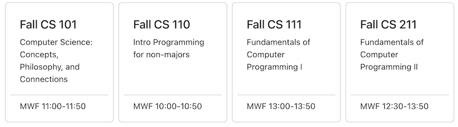

Add CSS (tailwind) styling so that the list of courses looks more like this:  from current pure html. Make it one row and make it fill the available screen width. Cards should appear uniform in height and internal spacing.